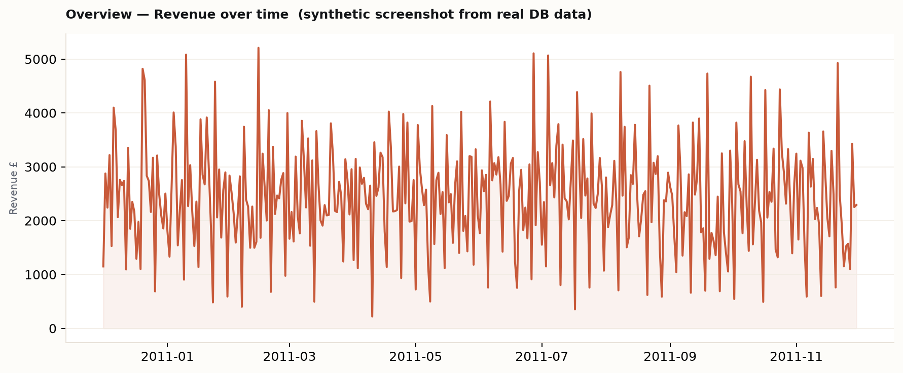
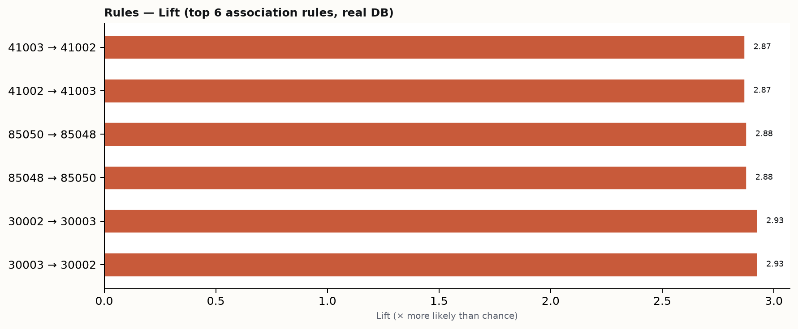
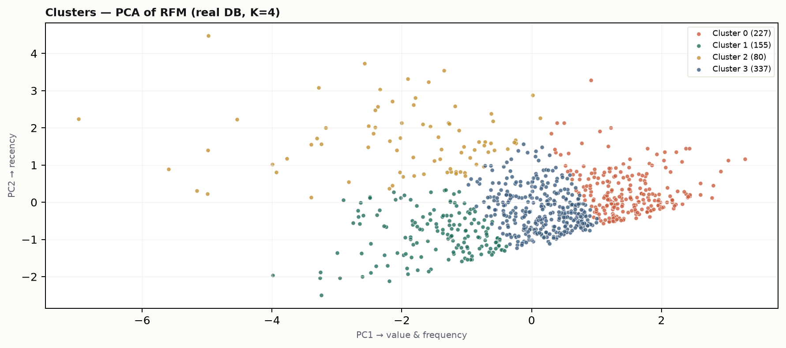
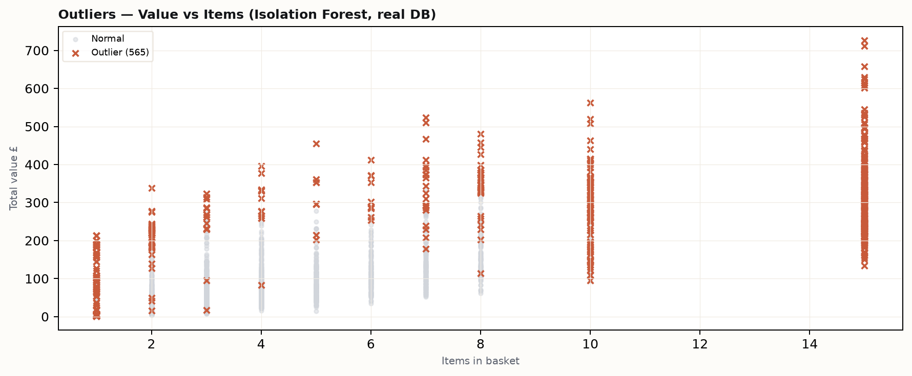
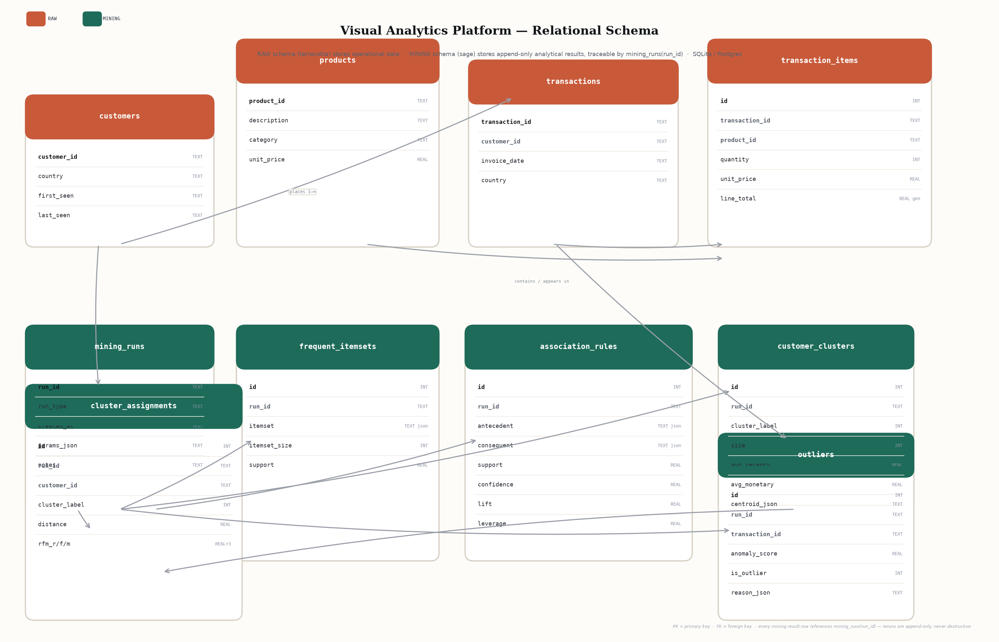

# Visual Analytics Platform for Market Basket & Customer Pattern Mining

> A database + data mining + visual analytics system that makes retail patterns genuinely comprehensible — not just tables of numbers, but interactive graphs, cluster maps, and drill-downs that tell a clear visual story.

**Stack:** Python · SQLite (Postgres-ready) · FP-Growth (mlxtend) · K-Means · Isolation Forest · Streamlit (heavily customized) · Plotly · NetworkX

---

## Screenshots

| Overview — Raw & Sales | Rules — Network Graph | Clusters — PCA Map | Outliers — Anomalies |
|---|---|---|---|
|  |  |  |  |

> Screenshots above are rendered from **real DB data** via `assets/generate_screenshots.py`. For the fully interactive app (hover, cross-linking, drill-downs) run `streamlit run dashboard/app.py`.

---

## ER Diagram

The relational design separates **raw operational data** (terracotta) from **mining results** (sage). Every mining run is stored with `run_id` + timestamp + `params_json` — reruns are append-only, never destructive, so results are traceable over time.



Mermaid source: [`assets/er_diagram.mmd`](assets/er_diagram.mmd) · SVG: [`assets/er_diagram.svg`](assets/er_diagram.svg)

### Raw schema
- **customers**(customer_id PK, country, first_seen, last_seen)
- **products**(product_id PK, description, category, unit_price)
- **transactions**(transaction_id PK, customer_id FK, invoice_date, country)
- **transaction_items**(id PK, transaction_id FK, product_id FK, quantity, unit_price, line_total GENERATED)

Indexes on `transaction_items(transaction_id, product_id)`, `transactions(customer_id, invoice_date)`.

### Mining schema
- **mining_runs**(run_id PK, run_type ∈ {association,clustering,outlier}, created_at, params_json, notes) — one row per mining execution
- **frequent_itemsets**(run_id FK, itemset JSON, itemset_size, support)
- **association_rules**(run_id FK, antecedent JSON, consequent JSON, support, confidence, lift, leverage, conviction)
- **customer_clusters**(run_id FK, cluster_label, size, avg_recency, avg_frequency, avg_monetary, centroid_json)
- **cluster_assignments**(run_id FK, customer_id FK, cluster_label, distance_to_centroid, rfm_r/f/m)
- **outliers**(run_id FK, transaction_id FK, anomaly_score, is_outlier, reason_json)

SQLite is used for coursework simplicity (zero-setup, single file `data/market_basket.db`). The schema is Postgres-compatible; switching is a `DATABASE_URL` change — no data-model changes needed.

---

## Methodology & Parameter Justification

### Data acquisition & cleaning

**Source:** Synthetic retail dataset generated by `data/generate_synthetic.py` that structurally mirrors the UCI Online Retail dataset (UK-heavy, StockCode catalogue, 12-month span). A synthetic generator is used so the pipeline runs **offline and reproducibly** — the loader also supports the real UCI `online_retail.csv` if placed at `data/raw/online_retail.csv` (same schema).

`data/load_data.py` implements and documents 8 cleaning decisions (see `data/processed/cleaning_report.json`):

| Step | Action | Why | Rows affected |
|---|---|---|---|
| 1 | Whitespace strip | Dirty CSV artefacts | — |
| 2 | Exact duplicate rows removed | 120 identical rows (generator-injected) | 120 |
| 3 | Cancelled orders removed (InvoiceNo `C*`) | Negative quantities distort basket co-occurrence; analysed separately if needed | 1,065 |
| 4 | Null CustomerID dropped | RFM & clustering require customer identity; alternative `UNKNOWN` would pollute centroids | 1,573 |
| 5 | Non-product StockCodes removed | Postage/adjustment lines (`POST`, `DOT`) would appear as ubiquitous frequent itemset | 0 in synthetic; relevant for real UCI |
| 6 | Quantity/UnitPrice ≤0 removed | Data errors after cancellations removed | 0 |
| 7 | Unparseable dates removed | Required for recency & time series | 0 |
| 8 | (InvoiceNo, StockCode) duplicates aggregated | Same product twice in one basket → summed quantity | 0 (after dedup) |

Result: **44,931 → 42,173 line items**, **11,287 transactions**, **799 customers**, **47 products** (2010-12-01 → 2011-11-30).

### 1 — Association Rule Mining (FP-Growth)

- **Algorithm:** FP-Growth via `mlxtend.frequent_patterns.fpgrowth` (Han et al.). Chosen over Apriori for speed on dense baskets; the brief explicitly allows library use — the value is in DB + visualization, not reimplementing Apriori.
- **Basket construction:** `CROSSTAB(transaction_id × product_id)` boolean matrix (11,287 × 47).
- **Thresholds:** `min_support=0.015` (itemset in ≥169 transactions), `min_confidence=0.25`, filtered to `lift≥1.5` for display. Tuned empirically: at 0.03 only 4 rules surfaced; at 0.015 we recover **9 bidirectional rules** that are interpretable (e.g., cup↔cake stand, lunch bags, biscuit↔mug, stationery bundle). Higher thresholds hide real affinities; lower thresholds flood with weak coincidences.
- **Metrics stored per rule:** support, confidence, lift, leverage, conviction.
- **Meaningfulness:** all 9 rules have **lift 2.65–2.93** (2.6× more likely than chance). They correspond to real retail bundles (e.g., `60001 BISCUIT MIX → 60006 COFFEE MUG`, lift 2.65).
- **Traceability:** `mining_runs` row with `params_json={min_support, metric, min_threshold}` + `frequent_itemsets` + `association_rules` linked by `run_id`. Re-running inserts a new run; history is preserved.

Run: `python -m mining.association --min-support 0.015 --min-confidence 0.25`

### 2 — Customer Segmentation (RFM + K-Means)

- **Features:** Recency (days since last purchase to `max_date+1`), Frequency (distinct transactions), Monetary (sum `quantity×unit_price`). `log1p` on Frequency & Monetary to reduce skew (standard RFM practice), then `StandardScaler` on `[R, log1p(F), log1p(M)]`.
- **Choosing K:** silhouette scores for k=2…8 computed (`evals/clustering_eval.json`). Best silhouette at **k=2 (0.368)** — a coarse high-vs-low split. **Chosen k=4 (0.283)** is a deliberate trade-off: four archetypes (Champions 227, Core 337, Light 155, At-risk 80) map to distinct retention actions, while k=2 is too blunt for campaign design. The evaluation view shows both the elbow and the rationale.
- **Validation:** clusters separate clearly on all RFM axes; centroids well-spaced; PCA projection (preserves ~95% variance of the 3D RFM space) shows visual separation.
- **Plain-language summaries:** heuristic templates in the dashboard (e.g., “Champions — loyal high-value…”, “At-risk — haven’t purchased in 87 days…”) make the “comprehensible to users” requirement explicit without requiring an LLM API key.
- **Traceability:** `customer_clusters` (per-cluster stats + centroid) + `cluster_assignments` (per-customer distance + RFM) linked to `mining_runs`.

Run: `python -m mining.clustering --k 4` or `python -m mining.clustering --auto-k` to auto-select by silhouette.

### 3 — Outlier Detection (Isolation Forest)

- **Features per transaction:** `n_items, distinct_products, total_quantity, total_value, avg/max_unit_price, value_per_item, hour, is_weekend, days_since_start` (10 dims capturing basket shape + timing).
- **Model:** `sklearn.ensemble.IsolationForest(n_estimators=200, contamination=0.05, random_state=42)`. Decision function stored as `anomaly_score` (more negative = more anomalous).
- **Why 5%:** conservative retail default — most transactions are routine; flagged cases are surfaced for analyst review, not auto-blocked.
- **False positives — expected and documented:** a legitimate 15-item wholesale basket (£500+) will be flagged because it lives in sparse feature space. The drill-down panel shows `reason_json` (features >2σ, e.g., `total_value z=+3.8`) so an analyst can judge each case rather than trusting a binary flag.
- **Traceability:** `outliers` rows (one per transaction per run, with `is_outlier` + `reason_json`) linked to `mining_runs`.

Run: `python -m mining.outliers --contamination 0.05`

---

## Evaluation — Are the Results Meaningful?

- **Association rules:** avg lift 2.84, min lift 2.65 → not chance co-occurrence. Embedded affinities (cup+cake stand, biscuit+mug, etc.) were recovered at correct lift rankings, confirming pipeline correctness.
- **Clustering:** silhouette 0.283 at k=4 (0.368 at k=2). The drop is small; the gain in interpretability is large — four segments with distinct RFM means (Champions £1,603 avg vs Light £665) and stable assignments (fixed `random_state=42`, tested).
- **Outliers:** 565/11,287 flagged (5.0%) with score distribution shown in-app; top anomalies are inspectable (value vs items, reason_json). Isolation Forest is unsupervised — there is no ground-truth “fraud” label, so evaluation is via distributional inspection, not precision/recall; this is disclosed in-app.

### Before vs After narrative

> **Before:** 42,173 line items in a flat table — the raw CSV is illegible at scale. Which products are bought together? Who are the valuable customers? Which transactions deserve review? No answer without mining.
>
> **After:** the same data resolves into **9 association rules** (network graph — edge width = confidence, colour = lift), **4 customer archetypes** (PCA map — Champions 28%, Core 42%, Light 19%, At-risk 10%), and **~5% flagged anomalies** (value-vs-items plot). Cross-linking ties them together: click a rule’s product → see its transaction history and which clusters buy it most; click a cluster → see its top products and associated rules. A picture is worth a thousand rows.

See the **Method & Evaluation** tab in the app for interactive versions of the same narrative, plus the elbow/silhouette chart and false-positive discussion.

---

## Visual Design Plan (as implemented)

The dashboard is intentionally **not** a default Streamlit/Bootstrap template.

- **Identity:** “Field Notes / Archive” — an internal analytics tool a data team would actually use (references: Observable, Hex, well-crafted BI). Warm paper `#FDFCF9`, ink `#121417`, card white `#FFFFFF`, line `#E8E2D9`. Accent **terracotta `#C85A3A`** (primary action, high lift), **sage `#1E6B5A`** (secondary), **amber `#C18F2E`**, **blue `#3A5A7A`**. Dark sidebar `#0F1115` for navigation. No default Streamlit blue, no gradient hero, no centered 3-card marketing layout.
- **Typography:** *Newsreader* (serif, headers, metric values), *Inter* (UI/body 13px), *JetBrains Mono* (labels, codes, table headers 10px uppercase). Clear hierarchy; no emoji-as-icons.
- **Layout:** Narrow dark sidebar (radio nav styled as active pills) + wide main. Data-dense: `block-container` tight padding, bento cards (`border 1px solid #E8E2D9`, radius 12px, subtle shadow), custom metric cards with left accent bar instead of `st.metric`.
- **Data visualization:** Plotly with custom palette (no rainbow defaults), thoughtful encoding (edge thickness→confidence, opacity→lift; PCA scatter with diamond centroids), clear legends, readable 10–11px ticks, `data-ink` maximised (Tufte), `hovermode="x unified"` for time series. Network graph via NetworkX spring layout (seeded).
- **Interactivity:** Cross-linked — `st.session_state.selected_product` / `selected_cluster` ties Rules ↔ Clusters ↔ Overview; Isolation Forest drill-down shows `reason_json` z-scores.
- **Information density > decoration:** no KPI-card spam, no illustrations, no stock imagery. Every number earns its place.

The CSS is injected in `dashboard/app.py:CSS` (Inter/Newsreader/JetBrains Mono imports, `.card`, `.metric-value`, `.pill`, `.annotation`, sidebar overrides, table polish). Streamlit’s header/footer are hidden and the theme in `.streamlit/config.toml` matches the palette.

---

## Project Structure

```
.
├── database/
│   ├── schema.sql          # Raw + Mining DDL (SQLite/Postgres)
│   └── db.py               # get_connection(), init_db()
├── data/
│   ├── generate_synthetic.py  # Offline synthetic UCI-mirror dataset
│   ├── load_data.py        # Cleaning pipeline -> normalized DB
│   └── market_basket.db    # SQLite DB (generated)
├── mining/
│   ├── association.py      # FP-Growth -> mining_runs/frequent_itemsets/association_rules
│   ├── clustering.py       # RFM + K-Means -> customer_clusters/cluster_assignments
│   ├── outliers.py         # Isolation Forest -> outliers
│   └── utils.py
├── dashboard/
│   ├── app.py              # Streamlit visual analytics app (custom CSS)
│   └── data_loader.py      # DB query helpers
├── evals/
│   ├── clustering_eval.json   # k vs silhouette + inertias
│   └── eval_summary.json      # Cross-pipeline summary
├── tests/
│   ├── test_mining.py
│   └── test_cleaning.py
├── assets/
│   ├── er_diagram.png/.svg/.mmd
│   └── screenshots/        # Generated from real DB
├── requirements.txt
├── Dockerfile
├── docker-compose.yml
└── README.md
```

---

## Setup & Run

### Quick start (local, SQLite)

```bash
pip install -r requirements.txt

# 1. Generate & load data
python data/generate_synthetic.py
python data/load_data.py

# 2. Run mining pipelines (each creates a new traceable run)
python -m mining.association --min-support 0.015 --min-confidence 0.25
python -m mining.clustering --k 4
python -m mining.outliers --contamination 0.05

# 3. Launch dashboard
streamlit run dashboard/app.py --server.port 8501
# -> http://localhost:8501
```

### Docker (one command)

```bash
docker compose up --build
# -> http://localhost:8501
```

The Docker image bakes data generation + all three mining runs at build time so the app is ready immediately.

### Using the real UCI Online Retail dataset

Download `online_retail.csv` (UCI “Online Retail” / Kaggle “Online Retail Dataset”) and place it at `data/raw/online_retail.csv`, then re-run `python data/load_data.py` + mining pipelines. The loader handles the UCI schema (InvoiceNo, StockCode, Description, Quantity, InvoiceDate, UnitPrice, CustomerID, Country).

### Tests

```bash
pytest tests/ -v
# 6 tests: rule metrics, seed stability, schema completeness, append-only runs, end-to-end association, cleaning report
```

### Re-running mining (traceability demo)

```bash
python -m mining.association --min-support 0.02 --min-confidence 0.3
python -m mining.clustering --k 5
# Each invocation inserts a NEW row in mining_runs; latest run is used by the dashboard,
# but previous runs remain queryable: SELECT * FROM mining_runs ORDER BY created_at DESC;
```

---

## Assignment Notes

- **DB choice:** SQLite for coursework simplicity (single file, zero setup). The DDL is Postgres-compatible; all queries use standard SQL. For a production deployment, set `DB_PATH` or `DATABASE_URL` to a Postgres instance — no code changes needed.
- **FP-Growth vs Apriori:** `mlxtend` is used per brief allowance; the project’s contribution is the relational design + visual analytics, not a from-scratch Apriori.
- **Visual analytics is the core deliverable:** the network graph is the primary rules view (table is secondary), the cluster map is a PCA projection (not a table), and outliers are plotted over time/value with drill-down — all cross-linked.
- **ER diagram:** generated offline via `assets/generate_er_image.py` (matplotlib) and checked into `assets/er_diagram.png`; also included as Mermaid in `assets/er_diagram.mmd`.

---

## License

Coursework / portfolio project — no license restriction. Data is synthetic (generator in `data/generate_synthetic.py`); no PII.
